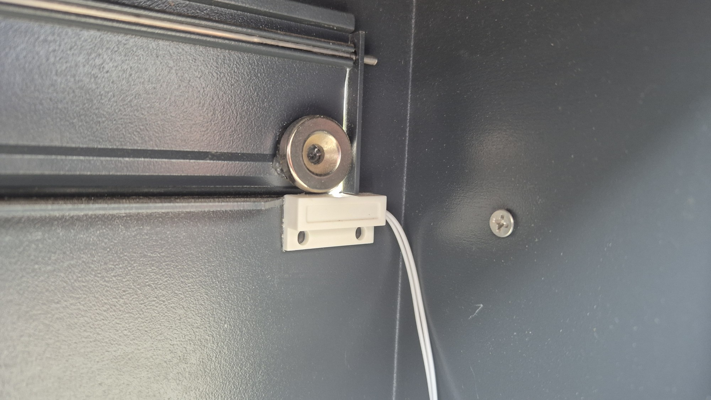
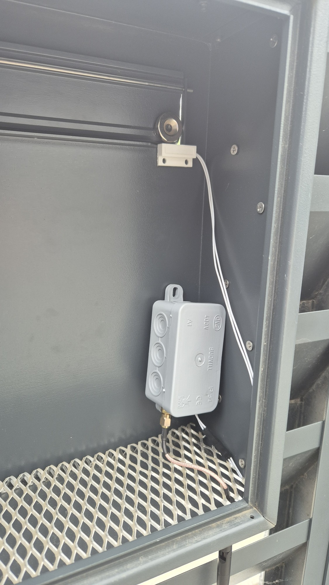
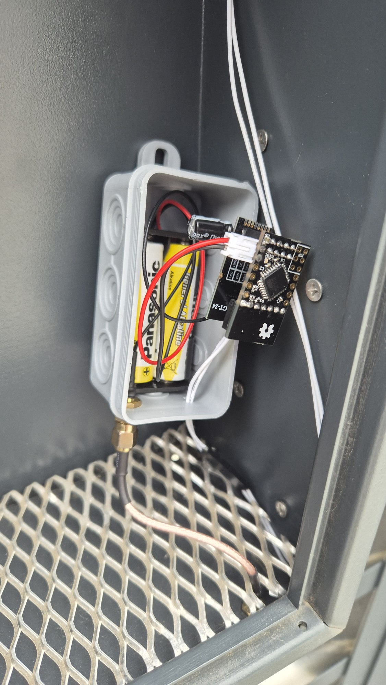

# Mailbox Sensor

This is [MySensors](https://www.mysensors.org) Mailbox/Door sensor built on [Sensebender Micro](https://www.openhardware.io/view/1) and NRF24L01+PA+LNA.

Connect reed switch between **D3** and **GND**. 
Power consumption in sleep mode is **5.6** µA.

Sensor with two AA 1.5V batteries is placed in [Surface-mounted junction box 75x45 IP54](https://e2.at/shopdetail/316.1?dps=30&so=nro&vt=75x45&id=16641).

 

 

 
