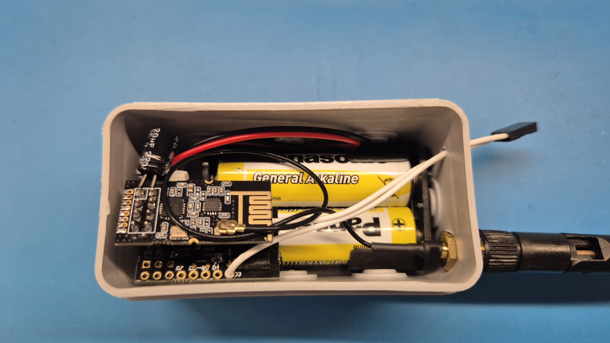

# Mailbox Sensor

This is [MySensors](https://www.mysensors.org) Mailbox/Door sensor built on [Sensebender Micro](https://www.openhardware.io/view/1) and NRF24L01+PA+LNA.

Connect reed switch between **D3** and **GND**. 
Power consumption in sleep mode is **5.6** µA.

 
