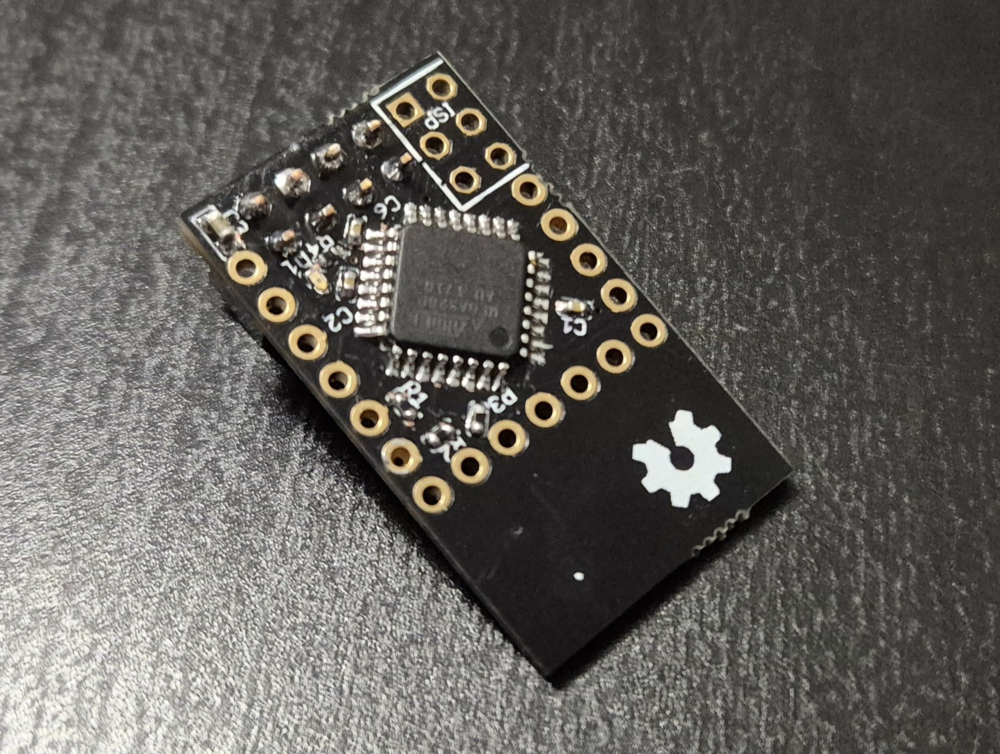

# Sensebender Micro - Blink test

This is simple LED blink test for newly assembled [Sensebender Micro](https://www.openhardware.io/view/1).

--------

--------

1. Assemble Sensebender Micro board
1. Set ATMega328P fuses
1. Flash [bootloader](../Bootloader/) into ATMega 328P

--------
 

