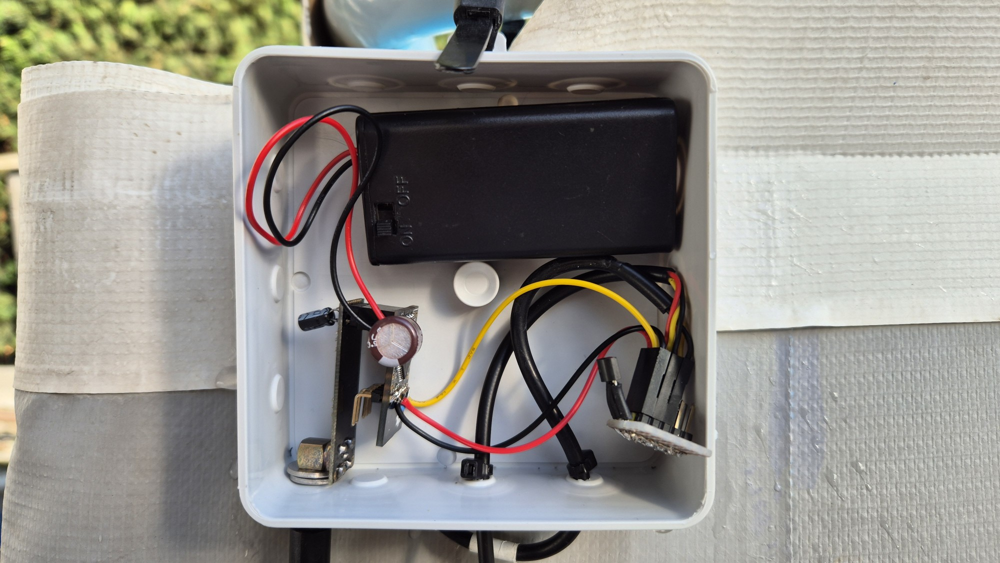
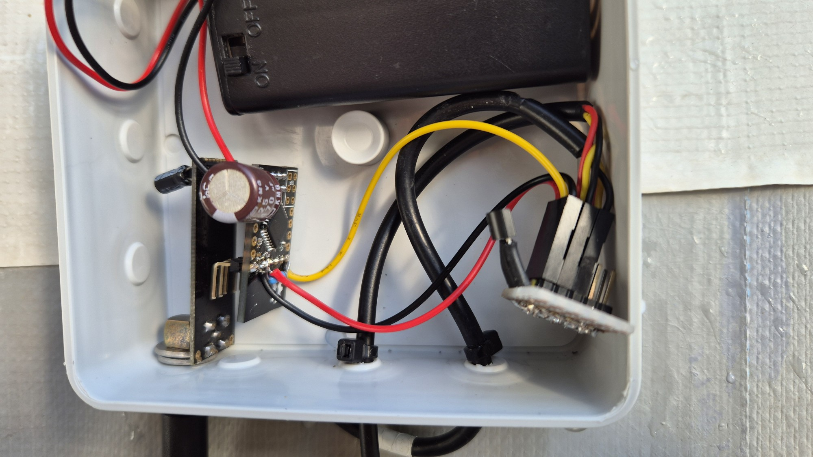

# Swimming pool thermometer

Thermometer is built on [Sensebender Micro](https://www.openhardware.io/view/1), NRF24L01+PA+LNA and DS18B20 temperature sensors. Thermometer is powered from two AA alkaline batteries.

------

------

