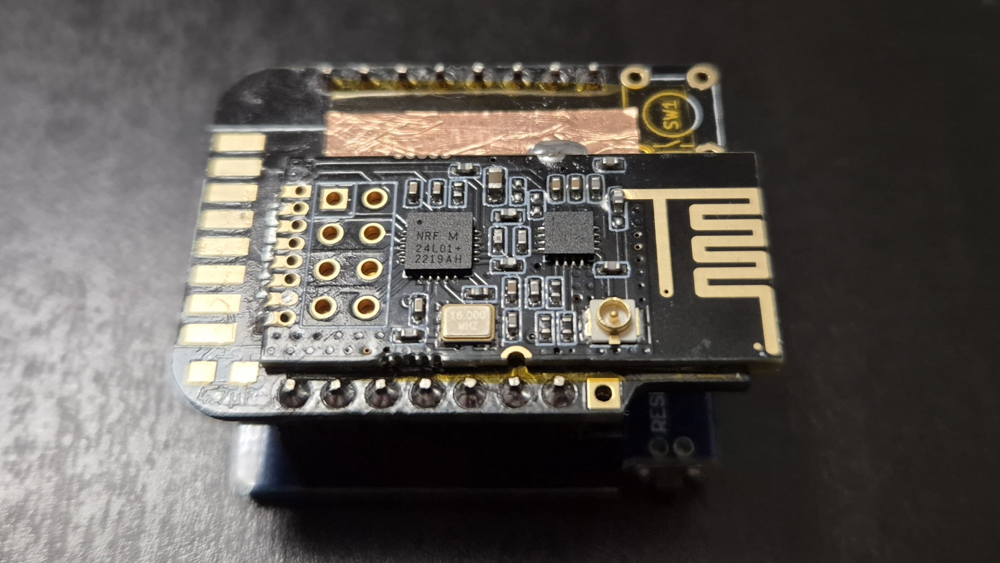

# MySensors MQTT Gateway

Gateway is built on Wemos D1 Pro v1.0 and [MySWeMosGWShield - WeMos Mini MySensors Gateway Shield](https://www.openhardware.io/view/303/MySWeMosGWShield-WeMos-Mini-MySensors-Gateway-Shield)

Additional hardware changes:
- added kapton tape and copper foil under the NRF24L01 radio to solve interference between WiFi and NRF24L01 2.4Ghz radios
- added external antennas for both radio

 
Wemos D1 Pro + NRF24L01+PA+LNA SMD

 
Wemos D1 mini + NRF24L01+PA+LNA SMD

